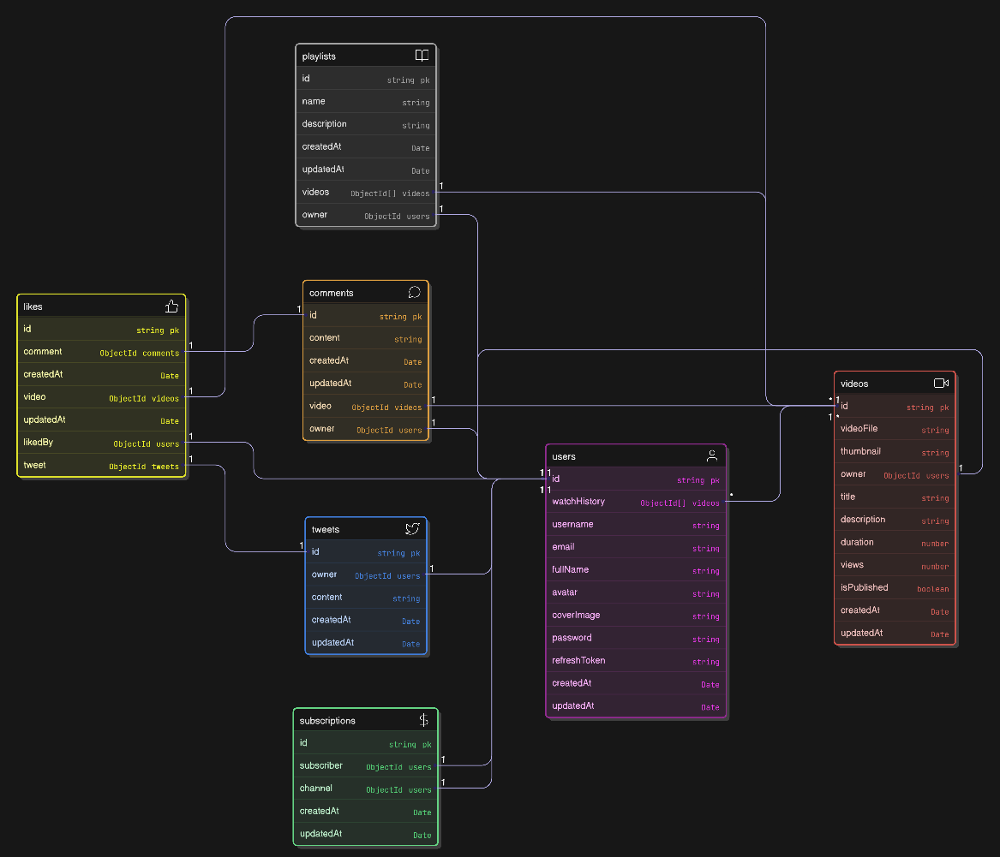

# VidTube API Documentation

## Overview
**VidTube** is a backend API for a video-sharing platform similar to YouTube. It supports user authentication, video uploads, subscriptions, comments, likes, and channel analytics. This API allows developers to integrate and manage all core functionalities programmatically.

---

## 📂 Data Model
You can view the database schema here:  
- [`Data Model Link`](https://app.eraser.io/workspace/3wrxfTGOGd58cTkE493s)



---

## 🔧 Services Used
- **MongoDB Atlas** – Database
- **Cloudinary** – Media file storage

---

## 📦 NPM Packages Used
- `express`, `mongoose`, `cors`, `dotenv`, `cookie-parser`, `bcrypt`, `jsonwebtoken`, `multer`, `cloudinary`, `mongoose-aggregate-paginate-v2`, `nodemon`, `prettier`

---

## 📂 API Endpoints

### 1️⃣ Healthcheck
| Method | Endpoint                  | Description |
|--------|---------------------------|-------------|
| GET    | `/healthcheck`            | Check API status |

### 2️⃣ Users (Authentication & Profile Management)
| Method | Endpoint                          | Description |
|--------|-----------------------------------|-------------|
| POST   | `/users/register`                 | Register a new user |
| POST   | `/users/login`                    | Login user |
| POST   | `/users/logout`                   | Logout user |
| GET    | `/users/current-user`             | Get current logged-in user |
| PATCH  | `/users/update-account`           | Update account details |
| PATCH  | `/users/change-password`          | Change user password |
| PATCH  | `/users/avatar`                   | Update user avatar |
| PATCH  | `/users/cover-image`              | Update user cover image |
| GET    | `/users/c/:username`              | Get channel profile by username |
| GET    | `/users/history`                  | Get user's watch history |
| POST   | `/users/refresh-token`            | Refresh access token using refresh token |

#### **Example Request (Get Current User's Details)**
```http
GET /users/current-user
```
##### **Response**
```json
{
  "statusCode": 200,
  "data": {
    "_id": "68b959a43744e688fd71630f",
    "username": "five",
    "email": "five@gmail.com",
    "fullname": "five",
    "avatar": "http://res.cloudinary.com/dxhdtpxgy/image/upload/v1756980492/ye5xzchgpwziplusfs7p.jpg",
    "coverImage": "http://res.cloudinary.com/dxhdtpxgy/image/upload/v1756983226/bgryezj57pkxu3688h34.jpg",
    "watchHistory": [],
    "createdAt": "2025-09-04T09:19:32.366Z",
    "updatedAt": "2025-09-04T19:33:00.641Z",
    "__v": 0
  },
  "message": "Current user fetched successfully",
  "success": true
}
```

### 3️⃣ Videos
| Method | Endpoint                  | Description |
|--------|---------------------------|-------------|
| POST   | `/videos`                 | Upload a video |
| GET    | `/videos`                 | Get all videos (supports pagination, search, sorting) |
| GET    | `/videos/:id`             | Get video details by ID |
| PATCH  | `/videos/:id`             | Update video details |
| DELETE | `/videos/:id`             | Delete a video |

### 4️⃣ Comments
| Method | Endpoint                  | Description |
|--------|---------------------------|-------------|
| POST   | `/comments`               | Add a comment to a video |
| GET    | `/comments/:videoId`      | Get all comments of a video |
| PATCH  | `/comments/:id`           | Update a comment |
| DELETE | `/comments/:id`           | Delete a comment |

### 5️⃣ Likes
| Method | Endpoint                        | Description |
|--------|---------------------------------|-------------|
| POST   | `/likes/toggle/v/:videoId`      | Like or unlike a video |
| POST   | `/likes/toggle/c/:commentId`    | Like or unlike a comment |
| POST   | `/likes/toggle/t/:tweetId`      | Like or unlike a tweet |
| GET    | `/likes/videos`                 | Get all videos liked by the user |

### 6️⃣ Subscriptions
| Method | Endpoint                        | Description |
|--------|---------------------------------|-------------|
| POST   | `/subscriptions/:channelId`     | Subscribe or unsubscribe a channel |
| GET    | `/subscriptions/c`              | Get channels the user is subscribed to |
| GET    | `/subscriptions/u/:channelId`   | Get all subscribers of a channel |

### 7️⃣ Tweets
| Method | Endpoint                  | Description |
|--------|---------------------------|-------------|
| POST   | `/tweets`                 | Create a new tweet |
| GET    | `/tweets/:userId`         | Get all tweets of a user |
| PATCH  | `/tweets/:tweetId`        | Update a tweet |
| DELETE | `/tweets/:tweetId`        | Delete a tweet |

### 8️⃣ Dashboard
| Method | Endpoint                        | Description |
|--------|---------------------------------|-------------|
| GET    | `/dashboard/stats/:channelId`   | Get channel stats (views, subscribers, videos, likes) |
| GET    | `/dashboard/videos/:channelId`  | Get all videos uploaded by a channel |

---

## 🔐 Authentication
All protected endpoints require JWT Bearer Tokens for authorization.

---

## 📌 Testing with Postman
Import the Postman Collection to explore endpoints:  
🔗 [Postman Collection Link](https://documenter.getpostman.com/view/38153132/2sB3HkpL5M)  

1. Open **Postman** → Click **Import** → Paste the link.  
2. Set **Authorization** with Bearer Token where required.  
3. Test any endpoint by selecting it and providing parameters.

---

## 🏆 Conclusion
This API is the backbone of **VidTube**, handling users, videos, subscriptions, comments, likes, and analytics. It is structured for scalability, security, and easy integration.

---

_© Created by **Huzaifa Ghadiyali**_
